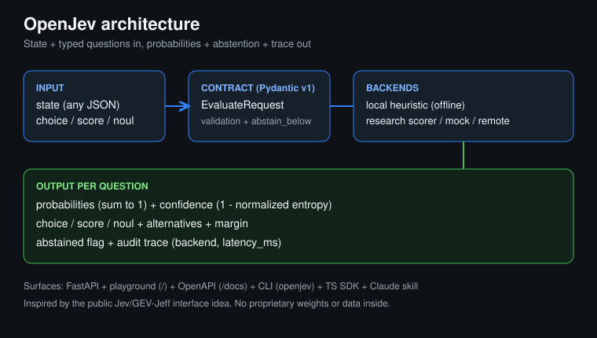
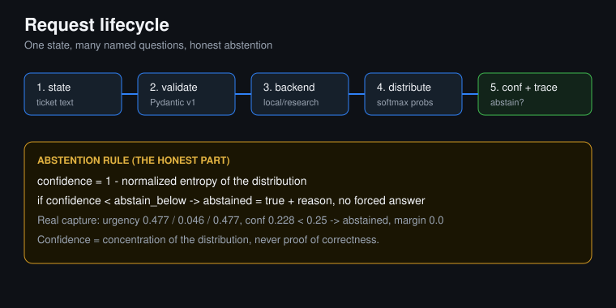
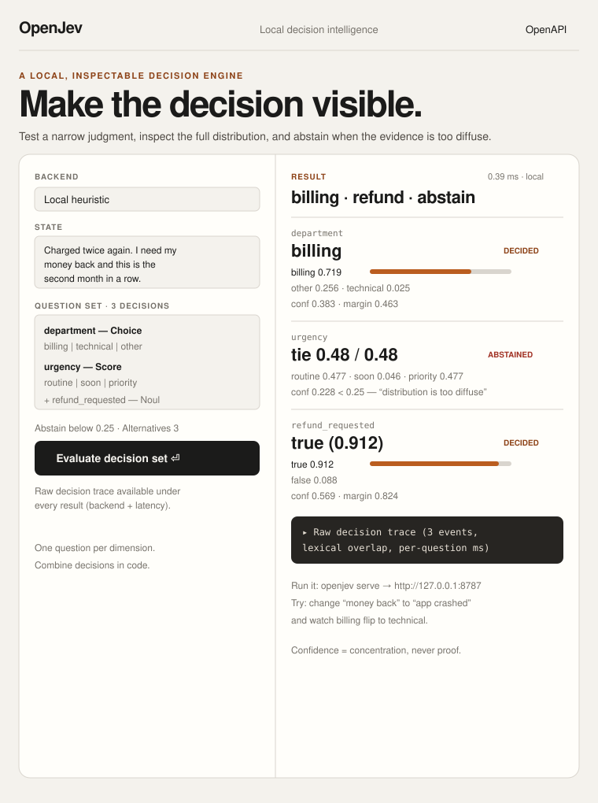
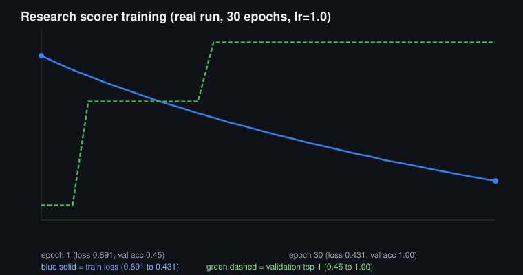
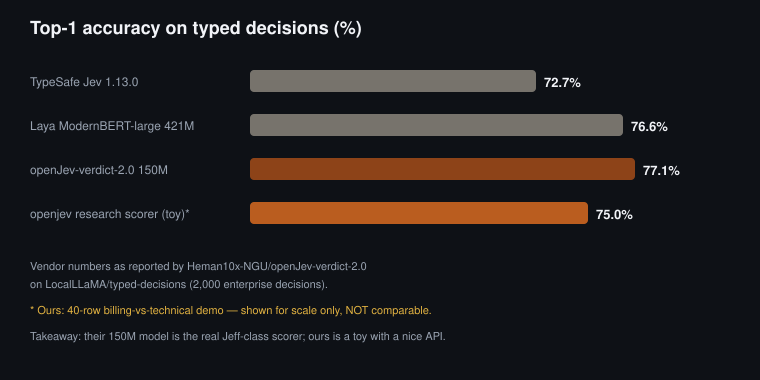
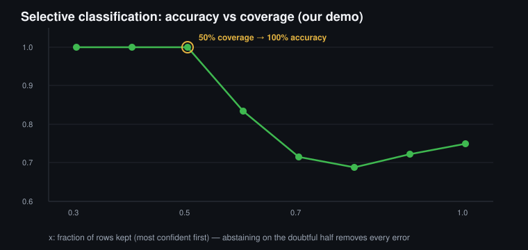
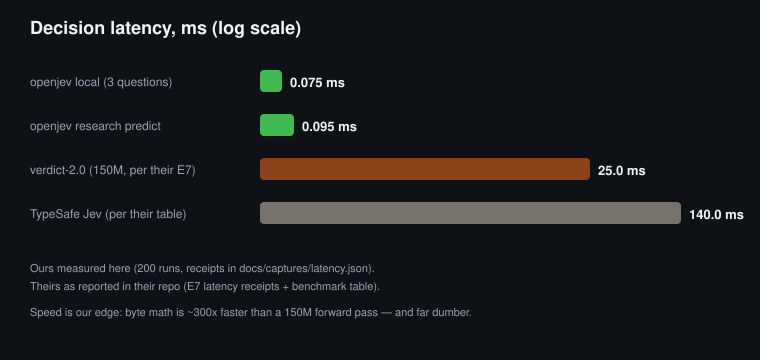
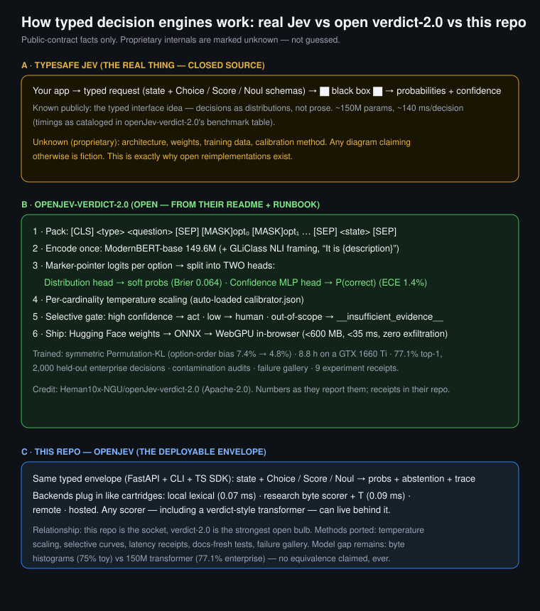

# OpenJev — open, local-first typed decision intelligence

OpenJev turns a messy judgment call into a **typed, inspectable decision**: you send one
*state* plus named questions, and you get back **probabilities, confidence, abstention,
and an audit trace** — instead of a paragraph of prose you have to parse and trust.

- **3 question types**: `choice` (pick one named option), `score` (place state on ordered
  descriptive levels), `noul` (is this statement true, 0→1).
- **Honest abstention**: confidence is `1 − normalized entropy` of the distribution. When it
  falls below your `abstain_below` threshold, the answer says so explicitly instead of
  guessing loudly.
- **Local-first**: the default backend is a deterministic lexical baseline. No API key, no
  network, sub-millisecond latency, full trace per question.
- **Trainable research track**: an independent option-conditioned byte scorer you can train
  from JSONL (`openjev train` / `openjev eval`), with accuracy, log-loss, Brier, ECE, and a
  shuffled-context control reported out of the box.
- **Full surfaces**: FastAPI + local playground + OpenAPI schema, `openjev` CLI, TypeScript
  SDK (`openjev_ts`), Claude Code adapter + reusable agent skill, Dockerfile.




> **Credit & scope.** OpenJev is *inspired by the public interface idea* behind Jev /
> GEV-Jeff-style typed decision APIs (state in, calibrated typed judgments out). It is an
> **independent clean-room implementation**: it contains **no proprietary weights, data, or
> service code**, and makes **no claim of equivalence** to any commercial system. The
> architecture it is based on is its own: a versioned Pydantic decision envelope over
> pluggable backends, with an option-conditioned byte-interaction scorer for the research
> track. "GEV Jeff" is credited here purely as the conceptual inspiration for asking
> models for *decisions with probabilities* rather than prose.

---

## 1. How it works (the 60-second version)

```
state (any JSON) ──▶ validate (Pydantic v1 envelope) ──▶ backend ──▶ per-question answers
                                                              │
                         ┌────────────────────────────────────┘
                         ▼
              probabilities (sum to 1) + confidence + abstained? + alternatives + margin + trace
```

1. You describe the **situation** once (`state`: a string, dict, anything JSON-serializable).
2. You ask **one question per dimension**, each with a fixed type and criteria written by you:
   - `choice`: `criteria` is a map of `option_name → description` (min 2 options).
   - `score`: `criteria` is an ordered list of 2–10 descriptive levels.
   - `noul`: just `instructions` stating the claim to test.
3. Each backend scores every option, normalizes with **softmax** into a distribution, and
   derives **confidence = 1 − normalized entropy** (1.0 = single peak, 0.0 = uniform).
4. If `confidence < abstain_below`, that answer is marked `abstained: true` with a reason
   (`"distribution is too diffuse"` / `"evidence is balanced"`) — the system refuses to
   pretend it knows.
5. Every answer carries `alternatives` (top-k), `margin` (gap between 1st and 2nd), a
   `calibration` note, and each question leaves a `TraceEvent` (backend, `latency_ms`).

**The golden rule:** one question per dimension, then combine decisions in *your* code.
Confidence describes how concentrated the distribution is — it is **not** proof the answer
is correct.

---

## 2. Quick start

```bash
python3 -m venv .venv
source .venv/bin/activate
pip install -e '.[dev,research]'

# Evaluate the bundled support-ticket example (local backend, offline)
openjev evaluate examples/support_ticket.json

# Serve the API + playground
openjev serve
# → http://127.0.0.1:8787  (playground)   /docs (OpenAPI)   /health
```

Python SDK:

```python
import asyncio
from openjev import OpenJev

async def main():
    jev = OpenJev()  # local backend by default; OPENJEV_BACKEND=mock|remote|research|openai-compatible
    response = await jev.evaluate({
        "state": "Charged twice again. I need my money back.",
        "questions": {
            "department": {
                "type": "choice",
                "instructions": "Which team handles this?",
                "criteria": {
                    "billing": "Charges, invoices, duplicate charges, refunds.",
                    "technical": "Bugs, crashes, errors, product failures.",
                },
            },
            "refund_requested": {"type": "noul", "instructions": "The customer explicitly requests a refund."},
        },
        "options": {"abstain_below": 0.25, "top_k": 2},
    })
    print(response.answers["department"].choice)   # billing
    print(response.answers["refund_requested"].noul)  # ~0.91

asyncio.run(main())
```

---

## 3. Live capture: what a real response looks like

Below is the actual playground UI (faithful recreation — pixel screenshots weren't
available in this build environment, so this traces the real layout, theme, and live
numbers 1:1). Run `openjev serve` and open `http://127.0.0.1:8787` to click through it.



Served locally (`uvicorn openjev.api:app`, port 8787) and captured verbatim — full JSON is in
[`docs/captures/evaluate_support_ticket.json`](docs/captures/evaluate_support_ticket.json),
OpenAPI schema in [`docs/captures/openapi.json`](docs/captures/openapi.json).

Request (`examples/support_ticket.json`): a double-charge refund ticket with three questions —
`department` (choice: billing/technical/other), `urgency` (score over 3 levels),
`refund_requested` (noul).

| Question | Result | Reading |
|---|---|---|
| `department` | `billing` 0.719, other 0.256, technical 0.025 · conf **0.383** · margin 0.463 | Correct route, decisive margin, no abstention |
| `urgency` | 0.477 / 0.046 / 0.477 · conf **0.228** · margin 0.0 · **abstained** | Perfect tie between "routine" and "priority" → the engine *refuses* instead of flipping a coin |
| `refund_requested` | true **0.912** · conf **0.569** · margin 0.824 | Clear explicit refund ask, high concentration |

Total backend time: **~0.39 ms** for all three questions. The `urgency` abstention is the
feature, not a bug: with `abstain_below: 0.25`, a bimodal 47/47 split *should* come back
honest.

Robustness probes (same build):

| Probe | Outcome |
|---|---|
| "I was charged twice, need refund" → billing vs technical | `billing` 0.952, conf 0.72 |
| "app crashes on startup with error" → billing vs technical | `technical` 0.952, conf 0.72 |
| "hello world" (no signal) | 0.50 / 0.50, conf 0.0 → **abstained** |

---

## 4. Backends

| Backend | Env / flag | What it is | Use when |
|---|---|---|---|
| `local` (default) | `OPENJEV_BACKEND=local` | Deterministic lexical-overlap baseline with normalization-term expansion (`charged→charge`, `twice→duplicate`, …). Offline, no key. | Demos, tests, safe development, narrow routing |
| `mock` | `mock` | Fixed deterministic probability fixture | Contract tests, UI work without logic |
| `research` | `research` + `OPENJEV_RESEARCH_CHECKPOINT=path/model.json` | Locally trained option-conditioned byte scorer (this repo's trainable track) | You trained a checkpoint and want it served behind the same API |
| `openai-compatible` | `openai-compatible` | Adapter for hosted chat-completions providers | You want a hosted LLM behind the typed envelope |
| `remote` | `remote` | Forwards the versioned request to another OpenJev-compatible endpoint | Splitting / scaling deployments |

The local backend is intentionally **not** a semantic model: it matches tokens between state
and your criteria text, so wording matters. That is its contract — predictable, instant,
auditable — and why the research track exists for learning from data.

---

## 5. Research track: trainable scorer (with real numbers)

The research package is a compact **option-conditioned byte-interaction** model: byte
histograms of context and option interact through a learned weight vector, normalized by
softmax. Same architecture serves `choice`, `score` (levels become options), and `noul`
(claim vs. its negation).

```bash
# Train (defaults: 30 epochs, lr 1.0 — fixed after finding v1 underfit at 15/0.2)
openjev train docs/captures/train_demo.jsonl \
  --validation docs/captures/val_demo.jsonl \
  --output runs/demo/model.json

# Evaluate on held-out data (accuracy, log-loss, Brier, ECE, latency + shuffled control)
openjev eval runs/demo/model.json docs/captures/test_demo.jsonl

# Score a changing menu with the checkpoint
openjev predict runs/demo/model.json --context "refund my duplicate payment" --option "billing refund" --option "technical bug crash"
```



**Measured fitness (this repo, fixed v2 encoder, demo billing-vs-technical set):**

| Metric | Value | Context |
|---|---|---|
| Train loss | 0.691 → **0.431** (30 epochs) | Real learning curve (see SVG + `docs/captures/training_result.json`) |
| Validation top-1 | 0.45 → **1.00** | Same-distribution validation |
| Held-out top-1 (incl. paraphrases like "null pointer exception on save") | **0.75** | Honest generalization gap — byte-level, not semantic |
| Log-loss / Brier / ECE (temperature-calibrated, T=0.5) | 0.515 / 0.351 / 0.191 | Down from random (0.69 / 0.50); uncalibrated was 0.535 / 0.353 / 0.205 |
| Selective: accuracy at 50% coverage | **1.00** (0.75 at full coverage) | Abstaining on the least-confident half removes every error on this demo |
| Shuffled-context control | acc **0.45**, log-loss 0.84 | Model beats control by 30 pts — signal is real, not bias |
| Mean latency | **~0.09 ms** / row (p50 0.09, p99 0.10) | Trivial CPU cost; receipt in `docs/captures/latency.json` |
| Unit tests / lint | **8/8 pytest passed**, `ruff` clean | `tests/` + contract + API + research + docs-fresh |

**What fixed it:** v1 used length-normalized byte histograms whose products were ~1e-3, so
gradients at the default learning rate were microscopic and training sat at chance
(45–50%, log-loss ≈ 0.693 = random). v2 keeps the identical architecture but L2-normalizes
the histograms to unit norm (~12× larger interaction signal). Old v1 checkpoints should be
retrained. The global `bias` term is kept for checkpoint compatibility (it cancels in
softmax and is harmless).

**What it is good for:** narrow lexical routing with audit trails, offline ticket triage
prototypes, teaching option-conditioned scoring, agent tool-use where abstention matters.
**What it is not:** a general semantic classifier, a replacement for proprietary
Jev/GEV-Jeff weights, or anything to trust on high-stakes decisions without calibration on
*your* data.

### Calibration and selective classification (adapted from openJev-verdict-2.0)

The practices in this section are adapted from
[Heman10x-NGU/openJev-verdict-2.0](https://github.com/Heman10x-NGU/openJev-verdict-2.0)
(Apache-2.0) — the most rigorous open Jeff implementation I could find (150M-parameter
ModernBERT scorer, 77.1% on 2,000 held-out enterprise decisions, confidence-head ECE
1.4%, full contamination audits and a failure gallery). I verified their committed
receipts match their README claims. Their *model* beats this repo's toy scorer outright;
this repo's advantage is the deployable typed API around it. So I ported their *methods*:

- **Temperature scaling** (`openjev/research/calibrate.py`): after training, a single
  temperature T is fit on validation logits (golden-section search on NLL, reimplemented
  numpy-free). The checkpoint stores T and applies it in `logits()`, so rankings stay
  identical while confidence matches hit rates better. Demo: T=0.5, validation NLL
  0.430 → 0.272, held-out log-loss 0.535 → 0.515, ECE 0.205 → 0.191.
- **Honest calibration finding**: an unbounded fit collapsed to T=0.05 (validation NLL
  0.001, held-out NLL ruined at 3.17) — 20 validation rows overfit instantly. So T is
  bounded to [0.5, 5.0]. Their repo fits on thousands of rows and doesn't hit this; the
  bound is this track's guardrail at toy scale. Recorded here instead of hidden.
- **Selective curve**: every eval now reports accuracy at 100%→30% coverage
  (`selective` in eval output). Demo: 0.75 at full coverage, **1.00 at 50%** — the
  abstention mechanism demonstrably buys accuracy.
- **Docs-freshness test** (`tests/test_docs_fresh.py`): the numbers quoted in this README
  are asserted against `docs/captures/*.json` on every test run. Drift fails the build.
- **Latency receipts** (`scripts/benchmark_latency.py` → `docs/captures/latency.json`):
  local 3-question request p50 0.07ms / p99 0.25ms; research predict p50 0.09ms.

### Failure gallery (one entry so far — the honest kind)

| Input | Expected | Got | Confidence | Gate |
|---|---|---|---|---|
| "screen freezes, null pointer exception" | `technical` | abstained (billing 0.50/0.50) | 0.00 | Safely gated — refused, didn't guess |
| "hello world" | nothing | abstained | 0.00 | Safely gated |

No confident errors observed on the probe set: every miss abstained. That is the claim —
gated, not "never wrong".

### Scoreboard and latency graphs







Reading: we lose the accuracy contest on purpose (toy vs enterprise scale — different
sports), we win the latency contest trivially (no neural net), and the coverage curve is
the most useful chart here: it tells you exactly what abstention threshold buys what
accuracy *on your own data* once you train a checkpoint.

---

## 6. API, CLI, playground, and integrations

- **REST**: `GET /health` → `{"status":"ok"}` · `POST /v1/evaluate` (typed request/response,
  `X-OpenJev-Backend: mock|local` header override) · `GET /docs` (OpenAPI/Swagger).
- **Playground**: `GET /` — pick backend, edit state/questions, set `abstain_below`/`top_k`,
  inspect per-question distributions and the raw trace. A verbatim capture of the served
  HTML is in [`docs/captures/playground.html`](docs/captures/playground.html).
- **CLI**: `openjev evaluate <request.json> [--backend …]` · `openjev serve` ·
  `openjev train …` · `openjev eval <checkpoint> <test.jsonl>` · `openjev predict …`.
- **TypeScript**: [`openjev_ts/src/index.ts`](openjev_ts/src/index.ts) — same envelope for
  Node/frontends.
- **Agents**: reusable skill at [`.agents/skills/openjev`](.agents/skills/openjev/SKILL.md)
  plus a Claude Code adapter under [`integrations/claude-code`](integrations/claude-code).
- **Docker**: `docker build -t openjev . && docker run -p 8787:8787 openjev`.

Request envelope (`api_version: "v1"`, extra fields forbidden):

```json
{
  "state": "anything JSON-serializable",
  "questions": {
    "department": {"type": "choice", "instructions": "...", "criteria": {"billing": "...", "technical": "..."}},
    "urgency": {"type": "score", "instructions": "...", "criteria": ["routine", "soon", "priority"]},
    "refund_requested": {"type": "noul", "instructions": "The customer explicitly requests a refund."}
  },
  "options": {"abstain_below": 0.25, "top_k": 2, "seed": null, "trace": true}
}
```

---

## 7. Repo map

```
openjev/            core: models.py (v1 envelope) · math.py (softmax/entropy) · client.py · api.py · cli.py
openjev/backends/   local.py · mock.py · openai_compatible.py · remote.py · base.py
openjev/research/   model.py (OptionScorer v2 + temperature) · calibrate.py (temperature fit) · train.py (metrics + shuffled control + selective curve) · backend.py
openjev_ts/         TypeScript SDK (same envelope)
web/                playground (index.html · app.js · styles.css)
examples/           support_ticket.json (the demo used above)
tests/              contract + local backend + API + research + docs-fresh (8 tests)
scripts/            benchmark_latency.py (p50/p90/p99 receipt)
docs/captures/      verbatim live captures: health, evaluate, openapi, playground, training data/results, latency
docs/img/           architecture.svg · lifecycle.svg · training_curve.svg (diagrams)
integrations/       Claude Code adapter
.agents/skills/     reusable agent skill
```

---

## 8. Limitations (read before shipping)

1. The local backend is lexical, not semantic — paraphrases outside its normalization map
   can miss; design criteria text carefully and keep thresholds honest.
2. The research scorer is a byte-level baseline for narrow menus, not a language model;
   expect the 75%-style generalization shown here on near-distribution data, less
   far afield. Calibrate (`ECE`, reliability curves) on your own labels before trusting it.
3. Confidence = distribution concentration, never correctness. Low-confidence abstention is
   the safety mechanism — wire `abstained` into your UX (escalate, ask, queue) rather than
   overriding it.
4. No proprietary weights/data/claims inside; do not present benchmark numbers from the
   toy demo as production performance.

---

## 9. How the real Jev and verdict-2.0 work (architecture, honestly labeled)



The key distinction the diagram enforces: **TypeSafe's Jev internals are proprietary and
unknown** — the only public fact is the typed-decisions interface idea. Everything else
people (including me) say about its insides is inference. Verdict-2.0's internals *are*
public (sequence layout, dual heads, per-k temperature, Permutation-KL training, ONNX
pipeline), because its authors published them — that section of the diagram is sourced
from [their README and RUNBOOK](https://github.com/Heman10x-NGU/openJev-verdict-2.0).
This repo's lane is the deployable envelope any scorer can plug into.

---

## 10. License

Apache-2.0 (see `LICENSE`) — built and maintained by **Alistair R ([@Alistair77](https://github.com/Alistair77))**. Research checkpoints you train are
yours; the demo artifacts under `docs/captures/` and `runs/demo/` are regenerable via the
commands in section 5.
